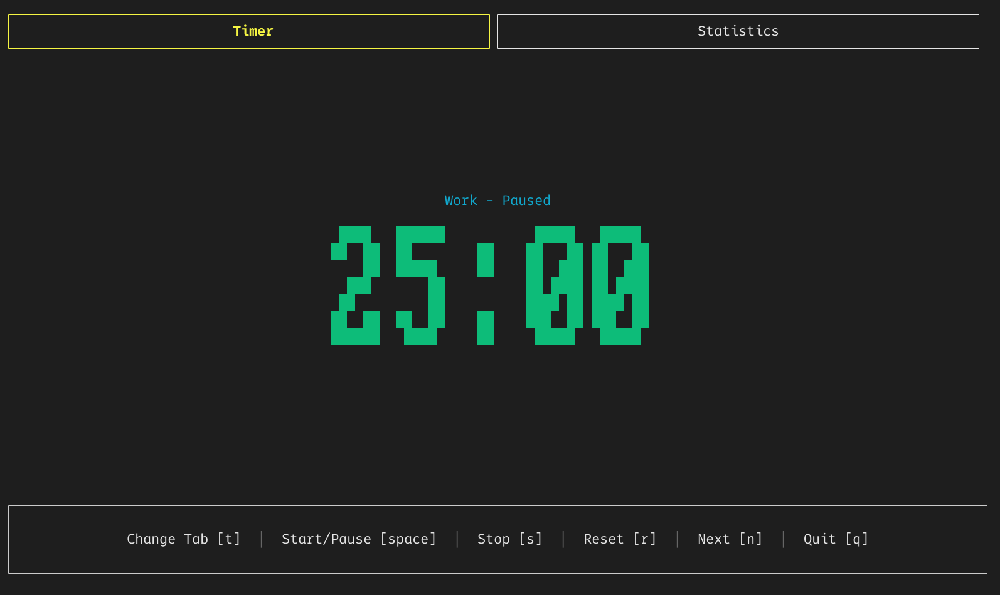

# 🍅 Pomotimer

A terminal-based Pomodoro timer for **Windows**, built with Rust. Features a minimal TUI, configurable work/break intervals, desktop notifications, and persistent session history via SQLite.

## Features

- **Pomodoro workflow** — Work, short break, and long break phases with automatic cycling
- **Tabbed interface** — Switch between timer view and statistics
- **Desktop notifications** — Alerts when a phase completes (configurable messages)
- **Persistent history** — Every completed session is stored in a local SQLite database
- **Statistics dashboard** — Visual bar charts showing daily and monthly focus time, with pagination to browse past periods
- **Configurable** — Timer durations, notification preferences, and auto-start all adjustable via TOML config



## Keybindings

### Timer tab

| Key     | Action              |
| ------- | ------------------- |
| `space` | Start / Pause       |
| `s`     | Stop cycle          |
| `r`     | Reset current phase |
| `n`     | Skip to next phase  |
| `t`     | Open Statistics tab |
| `q`     | Quit                |

### Statistics tab

| Key | Action                                                |
| --- | ----------------------------------------------------- |
| `t` | Return to Timer tab                                   |
| `s` | Toggle between daily (Week) and monthly (Month) scale |
| `n` | Scroll forward one page (next days / months)          |
| `p` | Scroll backward one page (previous days / months)     |
| `r` | Reset view to current week                            |
| `q` | Quit                                                  |


## Configuration

On first launch, a default config file is created at:

```
%USERPROFILE%\.config\pomotimer\config.toml
```

```toml
[timer]
work_mins = 25
short_break_mins = 5
long_break_mins = 15
long_break_after_sessions = 4
auto_start = false

[notifications]
enable = true
work_done_msg = "Time for a break!"
break_done_msg = "Back to work!"
```

## Data Storage

Completed iterations are recorded in a SQLite database at:

```
%USERPROFILE%\.local\share\pomotimer\pomotimer.sqlite3
```

Each entry stores the phase type, duration, and timestamps for later review in the Statistics tab.

## Installation

### Option 1 — Download from GitHub Actions

Pre-built `pomotimer.exe` is available as a build artifact from the latest CI run on the `main` branch. Go to **Actions → Rust → latest workflow → Artifacts** and download `pomotimer.exe`.

### Option 2 — Build from source

```bash
git clone https://github.com/<your-username>/pomotimer
cd pomotimer
cargo build --release
.\target\release\pomotimer.exe
```

## License

This project is licensed under the GNU General Public License v3.0. See the [LICENSE](LICENSE) file for details.


